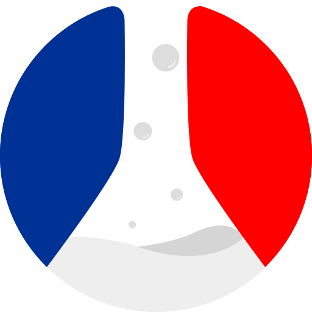

  
  <h1 align="center">Tell Me</h1>

  
  
  

---

> An awesome open source survey generator.

⚠️ _Work and documentation in progress!_

---

- [Roadmap](#roadmap)
- [Deployment](#deployment)
  - [Architecture](#architecture)
  - [PaaS & hosting providers](#paas--hosting-providers)
    - [Heroku](#heroku)
    - [Scaling](#scaling)
- [Contributing](#contributing)

---

## Roadmap

- Accessibility
- Handle survey file upload (in progress)
- Add public API to access survey results via a PAT (in progress)
- Allow survey per-result deletion (in progress)
- Add dashboard
- Teams (with an environment variable switch in order to host a shared BetaGouv service?)

## Deployment

### Architecture

1. **Application**  
   Let Me is a monolithic application gathering both web application and RESTful API
   written in Javascript / Node.js, running above [Next.js Framework](https://nextjs.org)).

2. **Database**  
   It requires a [PostgreSQL database](https://www.postgresql.org).

Both part are dockerized in order to ease deployment on any hosting configuration.

### PaaS & hosting providers

#### Heroku

_In progress._

#### Scaling

_In progress._

## Contributing

Please see our [CONTRIBUTING.md](/CONTRIBUTING.md).
